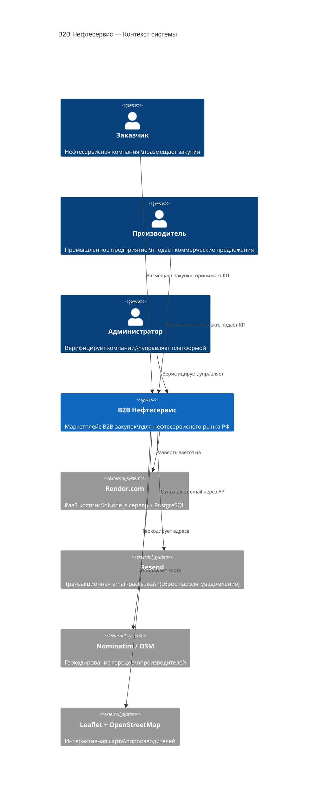

# Архитектура B2B Нефтесервис

## C4 Level 1 — System Context



---

## C4 Level 2 — Container Diagram

```mermaid
C4Container
    title B2B Нефтесервис — Контейнеры

    Person(customer, "Заказчик")
    Person(producer, "Производитель")
    Person(admin, "Администратор")

    System_Boundary(platform, "B2B Нефтесервис") {

        Container(frontend, "Frontend SPA", "HTML / CSS / Vanilla JS",
            "18 статических страниц.\nТемизация через CSS-переменные.\nJWT в localStorage.\nSPA-навигация без фреймворка.")

        Container(backend, "Backend API", "Node.js 24 / Express 5",
            "REST API, бизнес-логика,\nauthentication, file upload,\nматчинг заявок, рейтинги.\nHelmet, rate-limiter, CORS.")

        Container(ws, "WebSocket", "Socket.IO 4",
            "Реальное время:\nличные чаты по сделкам,\npush-уведомления.\nКомнаты: company, chat:orderId:company")

        Container(files, "File Storage", "Локальная ФС / uploads/",
            "Чертежи заявок (.pdf, .dxf, .dwg, .step),\nКП производителей (.pdf, .docx, .xlsx),\nФотографии профилей компаний.")

        ContainerDb(db, "PostgreSQL", "PostgreSQL (Render managed)",
            "10 таблиц: users, companies,\norders, proposals, messages,\nnotifications, favorites,\ncompany_photos, delivery_stages,\nverification_requests")
    }

    System_Ext(resend, "Resend API")
    System_Ext(nominatim, "Nominatim")

    Rel(customer, frontend, "Браузер", "HTTPS")
    Rel(producer, frontend, "Браузер", "HTTPS")
    Rel(admin, frontend, "Браузер", "HTTPS")

    Rel(frontend, backend, "REST API", "HTTPS / JSON + Bearer JWT")
    Rel(frontend, ws, "WebSocket", "wss://")

    Rel(backend, db, "Запросы", "pg / SQL")
    Rel(backend, files, "Читает/пишет файлы", "fs")
    Rel(backend, resend, "Email-уведомления", "HTTPS / API key")
    Rel(backend, nominatim, "Геокодирование", "HTTPS")
    Rel(ws, backend, "Разделяет процесс")
```

---

## C4 Level 3 — Backend Component Diagram

```mermaid
C4Component
    title Backend — Компоненты

    Container_Boundary(backend, "Node.js / Express") {

        Component(auth, "Auth Module", "JWT + scrypt",
            "Регистрация, логин, refresh-токены,\nсброс пароля через email.\nRate-limit: 15 req/15 min.")

        Component(orders, "Orders Module", "",
            "CRUD заявок на закупку.\nСтатусы: Активна / Отменена / Закрыта.\nПрикрепление чертежей через Multer.")

        Component(proposals, "Proposals Module", "",
            "КП от производителей.\nПринятие/отклонение заказчиком.\nEmail-уведомление при изменении статуса.\nАвтозакрытие заявки при победителе.")

        Component(deals, "Deals Module", "",
            "Сделки = принятые КП.\nЭтапы доставки: Согласование → Производство\n→ Отгрузка → Доставлено.")

        Component(matching, "Smart Matching", "NLP-like scoring",
            "Сравнивает текст заявки с профилем\nпроизводителя. Ключевые слова по\n5 категориям + бонус за свободные мощности.\nМакс. score: 100.")

        Component(companies, "Companies Module", "",
            "Профили заказчиков и производителей.\nГеокодирование городов (Nominatim).\nВычисляемый рейтинг (A+/A/B+/B/C).\nФотогалерея, ISO-сертификаты.")

        Component(messages, "Messaging Module", "",
            "Чат привязан к паре (orderId, producerCompany).\nСообщения хранятся в БД.\nSocket.IO для push-доставки.")

        Component(notifications, "Notifications", "",
            "Системные события для компании.\nПуш через Socket.IO + хранение в БД.\nСчётчик непрочитанных в сайдбаре.")

        Component(verification, "Verification", "",
            "Заявки компаний на верификацию.\nАдмин-панель: одобрить / отклонить.\nEmail-уведомление о решении.")

        Component(middleware, "Middleware", "Helmet / CORS / rateLimit",
            "requireAuth: JWT → user из БД.\nrequireRole: customer / producer / admin.\noptionalAuth: гостевой доступ.\nwithTransaction: atomic DB ops.")
    }

    ContainerDb(db, "PostgreSQL")
    System_Ext(resend, "Resend")

    Rel(auth, db, "users")
    Rel(orders, db, "orders")
    Rel(proposals, db, "proposals, orders")
    Rel(deals, db, "proposals, delivery_stages")
    Rel(matching, db, "companies")
    Rel(companies, db, "companies, company_photos, favorites")
    Rel(messages, db, "messages")
    Rel(notifications, db, "notifications")
    Rel(verification, db, "verification_requests, companies")
    Rel(proposals, resend, "Email при accept/reject")
    Rel(verification, resend, "Email при решении")
```

---

## Технологический стек

| Слой | Технология | Версия |
|------|-----------|--------|
| Runtime | Node.js | 24.x |
| Framework | Express | 5.x |
| Database | PostgreSQL | managed (Render) |
| DB клиент | pg (node-postgres) | 8.x |
| Auth | jsonwebtoken + scrypt | JWT HS256 |
| WebSocket | Socket.IO | 4.x |
| File upload | Multer | 2.x |
| Security | Helmet, express-rate-limit | — |
| Email | Resend | 4.x |
| Frontend | Vanilla HTML/CSS/JS | — |
| Hosting | Render.com | — |

## Ограничения и known trade-offs

| # | Ограничение | Причина | Когда решать |
|---|------------|---------|-------------|
| 1 | JWT в localStorage | Упрощение (нет httpOnly cookie) | При добавлении XSS-критичного функционала |
| 2 | Файлы на локальной ФС Render | Render ephemeral disk; файлы теряются при деплое | При переходе на S3/R2 |
| 3 | Нет очереди задач | Геокодирование в sync-режиме | При масштабировании > 100 компаний |
| 4 | Один Node-процесс | Нет cluster/PM2 | При нагрузке > ~500 RPS |
| 5 | Matching — keyword-based | Нет ML-модели | При накоплении данных о сделках |
