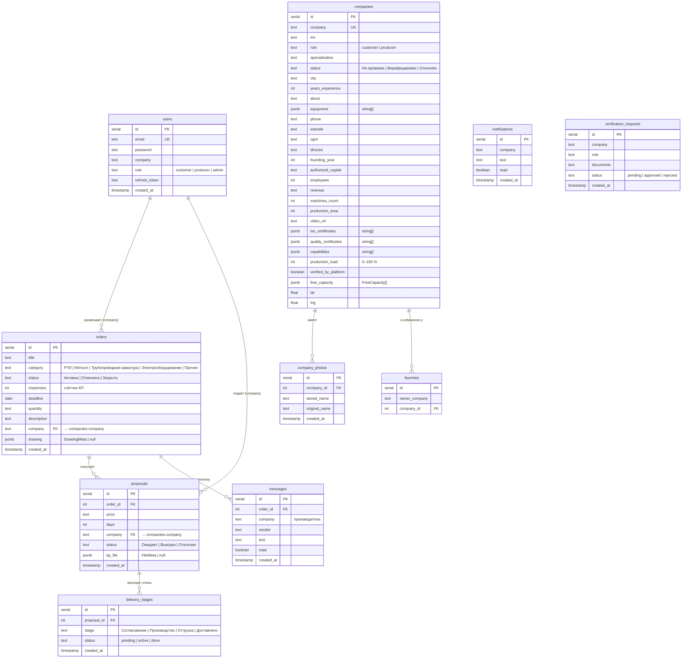

# Data Model — B2B Нефтесервис

## ER Diagram



---

## Ключевые бизнес-правила в данных

### Жизненный цикл заявки (Order)

```
Активна  ──(cancel)──▶  Отменена
Активна  ──(accept proposal)──▶  Закрыта
```

### Жизненный цикл КП (Proposal)

```
Ожидает  ──(accept)──▶  Выигран   ──▶  delivery_stages создаются
Ожидает  ──(reject)──▶  Отклонен
```
При победе КП: все остальные КП по той же заявке → `Отклонен`, заявка → `Закрыта`, `responses` на заявке инкрементируется при создании КП.

### Рейтинг производителя (вычисляемый, не хранится)

| Условие | Рейтинг | Метка |
|---------|---------|-------|
| win/total ≥ 0.7 и won ≥ 3 | A+ | Высокий |
| win/total ≥ 0.5 | A | Высокий |
| win/total ≥ 0.3 | B+ | Средний |
| win/total ≥ 0.15 или won > 0 | B | Средний |
| иначе | C | Низкий |

### Smart Matching Score (0–100)

```
Балл = min(совпадений_ключевых_слов_категории, 3) × 20   // макс 60
     + min(совпадений_слов_заголовка/описания, 2) × 15     // макс 30
     + (средняя_свободная_загрузка ≥ 30% ? 10 : 0)         // бонус
```

### Типы файлов

| Поле | Разрешённые расширения | Хранится как |
|------|----------------------|-------------|
| `orders.drawing` | `.pdf .png .jpg .jpeg .dxf .dwg .step .stp` | `DrawingMeta { storedName, originalName }` |
| `proposals.kp_file` | `.pdf .doc .docx .xls .xlsx .png .jpg .jpeg` | `FileMeta { storedName, originalName }` |
| `company_photos` | `.jpg .jpeg .png .webp` | `stored_name` в `uploads/photos/` |
