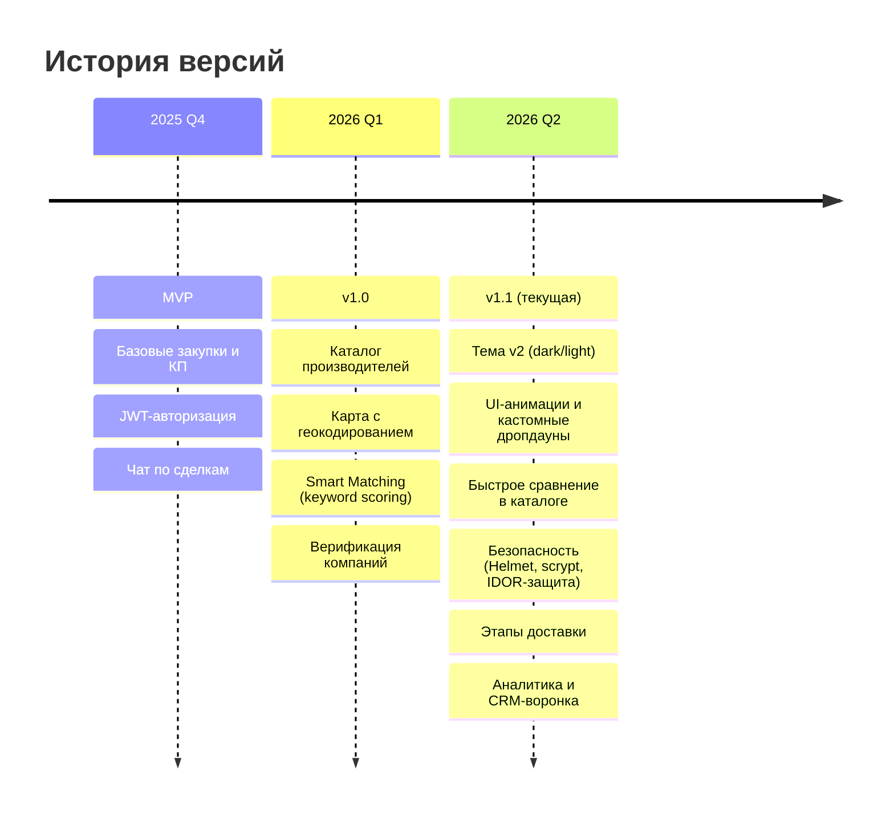

# Roadmap — B2B Нефтесервис

## Текущее состояние (v1, июнь 2026)

---

## Приоритеты следующих шагов

### 🔴 Критично (блокирует рост)

| # | Задача | Почему важно | Оценка |
|---|--------|-------------|--------|
| 1 | **Перенос файлов на S3/Cloudflare R2** | Render ephemeral disk: при каждом деплое все загруженные файлы удаляются | 2 дня |
| 2 | **Email-верификация при регистрации** | Сейчас любой может зарегистрировать чужой email | 1 день |
| 3 | **httpOnly cookie вместо localStorage для JWT** | XSS-атака может украсть токен из localStorage | 2 дня |

### 🟡 Важно (заметно улучшит продукт)

| # | Задача | Описание | Оценка |
|---|--------|---------|--------|
| 4 | **Поиск по заявкам для производителей** | Полнотекстовый поиск (PG `tsvector`) вместо keyword-фильтра | 3 дня |
| 5 | **Мобильная версия** | Адаптив для планшетов/телефонов (B2B → менеджеры в полях) | 1 неделя |
| 6 | **Экспорт в Excel/PDF** | Отчёты по заявкам и КП для бухгалтерии | 2 дня |
| 7 | **Уведомления на email** | Сейчас email только при accept/reject КП и верификации; нужно больше триггеров | 2 дня |
| 8 | **Дедлайн-автозакрытие заявок** | Cron-задача: заявки с истёкшим deadline → статус «Закрыта» | 1 день |

### 🟢 Развитие (конкурентные преимущества)

| # | Задача | Описание |
|---|--------|---------|
| 9 | **ML-матчинг** | Заменить keyword-scoring на embedding-модель (sentence-transformers). Обучать на данных принятых сделок |
| 10 | **Тендерный модуль** | Закрытые тендеры: заказчик приглашает конкретных производителей |
| 11 | **Оценки и отзывы** | После завершения сделки — mutual rating (заказчик ↔ производитель) |
| 12 | **Публичное API** | REST API для интеграции с ERP-системами (1С, SAP) |
| 13 | **Мобильное приложение** | React Native или PWA |
| 14 | **Электронный документооборот** | Подписание договоров через ЭЦП (Диадок/СБИС) |

---

## Архитектурные решения при масштабировании

```mermaid
flowchart LR
    subgraph Сейчас["Сейчас (< 100 компаний)"]
        A1[Single Node.js\nprocess]
        A2[Local filesystem\nuploads/]
        A3[Render PostgreSQL\nmanaged]
    end

    subgraph Фаза2["Фаза 2 (100–1000 компаний)"]
        B1[Node.js cluster\nили PM2]
        B2[Cloudflare R2\nS3-compatible]
        B3[PostgreSQL\nread replica]
        B4[Redis\nсессии + кэш]
    end

    subgraph Фаза3["Фаза 3 (10k+ пользователей)"]
        C1[Microservices\nили Fastify]
        C2[CDN для файлов]
        C3[PostgreSQL HA\n+ connection pool]
        C4[Message queue\nBullMQ/RabbitMQ]
    end

    Сейчас -->|«узкие места»| Фаза2
    Фаза2 -->|«узкие места»| Фаза3
```

### Когда переходить к Фазе 2

- Загрузка CPU > 70% в пике
- Время ответа API > 500ms p95
- Потеря файлов при деплое стала проблемой (происходит уже сейчас!)
- Количество активных компаний > 200

---

## Технический долг

| Проблема | Риск | Решение |
|---------|------|---------|
| Файлы на Render disk | Высокий — потеря данных | Migrate → Cloudflare R2 |
| JWT в localStorage | Средний — XSS | httpOnly cookie + SameSite |
| Нет миграций БД | Средний — сложно менять схему | Добавить `db-migrate` или `flyway` |
| 18 копий сайдбара в HTML | Низкий | Web components или SSR-шаблон |
| Нет e2e тестов | Средний | Playwright test suite |
| Нет мониторинга | Средний | Sentry + Grafana Cloud free tier |

---

## Frontend: путь к SPA

Сейчас: 18 статических HTML-страниц с Vanilla JS.

Когда стоит мигрировать на фреймворк:
- Количество страниц > 25
- Нужен SSR для SEO (каталог, профили компаний)
- Команда разработки > 2 человека

**Рекомендация при миграции:** SvelteKit — минимальный бандл, нативный SSR, нет виртуального DOM-overhead. Альтернатива: Nuxt 3 (если нужна большая экосистема).
