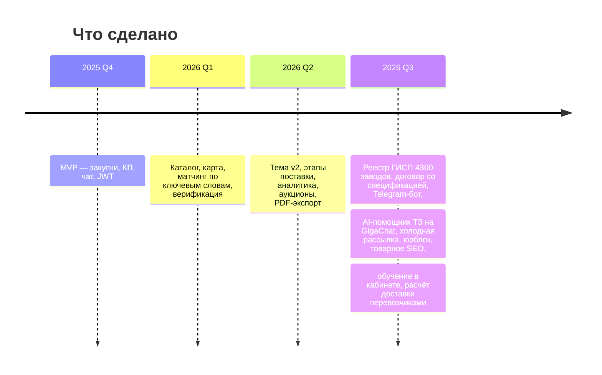

# Roadmap — ТехЗаказ

**Актуально на 08.08.2026.** Редакция от 30.07 переписала июньскую, которая вводила в заблуждение: в «критичном» числились задачи, давно закрытые (S3, email-верификация, httpOnly-куки), а инфраструктура описывалась по состоянию, которого уже нет. Один раз это стоило ошибки в опубликованном документе — в политику обработки данных попало утверждение о хранении базы за пределами РФ, взятое из устаревшего README.

Правило: если этот файл расходится с реальностью — чинить файл, а не подгонять реальность под него.

Правка 08.08: добавлен расчёт доставки, обновлено число тестов (в предыдущей редакции стояло 113 — устарело больше чем втрое).

## Где мы сейчас

| | |
|---|---|
| Прод | https://texzakaz.ru, VPS Selectel (Москва), PM2, автодеплой из `main` через GitHub Actions с CI-гейтом |
| Данные | PostgreSQL на самом VPS (`localhost`) — персданные в РФ, требование ст. 18 ч. 5 ФЗ-152 выполняется |
| Каталог | 4300 предприятий из реестра ГИСП ПП-719 и fabricators.ru, у 1900 есть email |
| Пользователи | 13 аккаунтов, из них 6 пришли из холодной рассылки |
| Закупки | 3 за всё время |
| Тесты | 464 юнита, `npm run check` + прогон тестов блокируют деплой. В сеть не ходят: интеграции проверяются по сохранённым ответам |

Последняя строка — главная. Продукт технически готов принимать поток, потока нет.

## Что уже работает

```mermaid
timeline
    title Что сделано
    2025 Q4 : MVP — закупки, КП, чат, JWT
    2026 Q1 : Каталог, карта, матчинг по ключевым словам, верификация
    2026 Q2 : Тема v2, этапы поставки, аналитика, аукционы, PDF-экспорт
    2026 Q3 : Реестр ГИСП 4300 заводов, договор со спецификацией, Telegram-бот,
            : AI-помощник ТЗ на GigaChat, холодная рассылка, юрблок, товарное SEO,
            : обучение в кабинете, расчёт доставки перевозчиками
```

Полный сквозной путь закрыт: заказчик размещает чертёж → матчинг уведомляет профильные заводы → приходят КП → сравнение с бенчмарком и выгрузкой в PDF → принятие → договор со спецификацией → этапы поставки → отзыв.

### Расчёт доставки (08.08.2026, третий перевозчик 13.08.2026)

В карточке КП заказчик видит не только цену изготовления, но и стоимость доставки от нескольких перевозчиков — ПЭК, Деловые Линии и Возовоз, наземная, экспресс и авиа. Маршрут берётся из сделки (город завода → город заказчика), габариты указывает завод при подаче КП.

Третьим планировался КИТ, ключ к их API получен. Не подключён по причине не на нашей стороне: `capi.gtdel.com` с 21.07.2026 отдаёт просроченный сертификат `*.gtdel.com`, и клиент, проверяющий TLS, туда не подключается вовсе. Обходить проверку сертификата ради расчёта нельзя, поэтому взят Возовоз — у него живой versioned API, документированные единицы измерения и осмысленные ошибки. КИТ вернём, если починят: модуль под него пишется по тому же контракту за вечер.

Что важно помнить при работе с этим кодом:

- **Цены публичные, а не договорные.** Мы не сторона сделки и цену от своего лица не обещаем — под расчётом стоит оговорка про публичный тариф. Убирать её нельзя: без неё первый же разошедшийся счёт станет претензией к платформе.
- **Проверка перевозчиков живёт вне деплойного гейта** (`npm run check:logistics`). Падение чужого сайта не должно останавливать нашу выкатку.
- **Оба капкана Деловых Линий были молчаливыми:** неверный формат кода города подставлял чужой город без ошибки, неверные единицы веса давали правдоподобную цену за несуществующий груз. Добавляя перевозчика, проверять надо не «отвечает ли», а «отвечает ли то же, что его собственный калькулятор». Подробности — в шапке `lib/logistics/dellin.js`.
- **У Возовоза капкан другой природы:** пункт задаётся названием, а «Москва» в их справочнике — семь разных мест, включая деревню в Кировской области. Расчёт при этом проходит, и о том, что выбор сделан за нас, говорит только `warnings` в ответе. Поэтому в запрос уходит только guid из их же поиска, а предупреждение про `location` считается отказом. Правило выбора города общее с нашим гео-слоем: разные терминалы у кандидатов — не считаем вовсе.

Оговорка по существу: эта работа спрос не приближает (см. следующий раздел). Она делает продукт лучше для тех, кто уже пришёл, и станет полезна ровно в той мере, в какой заводы начнут заполнять габариты.

### Чертёж до отклика (14.08.2026)

Первый живой завод прошёл путь подачи КП и уперся в то, чего мы не замечали: чертёж открывался только после подачи предложения, а предложение требует цену. Цену просили назвать вслепую.

Разомкнуто отдельным шагом «Посмотреть чертёж» — без цены и без обязательств. Защита не исчезла, но сменила природу: раньше чертёж почти никто не мог открыть, теперь его может открыть завод, который назвался. Запись именная (`order_drawing_requests`), заказчику приходит уведомление, кто именно открыл. Это осознанный размен: замок поменяли на журнал.

Там же вылез настоящий баг: кнопки «Просмотр» и «Скачать» рисовались всем подряд, сервер отвечал на них отказом, и завод получал на экран голый JSON «Нет доступа к чертежу этой закупки». Правило работало верно, а выглядело как поломка сайта. Кнопок, заведомо ведущих в ошибку, больше нет.

### Отказ по прямой ссылке (15.08.2026)

Продолжение того же разбора. Кнопки, ведущие в заведомый отказ, 14.08 убрали — но причина, по которой отказ выглядел поломкой сайта, осталась. Чертёж, файл КП, договор и все выгрузки открываются переходом браузера, а не через `apiFetch`, и ловить ответ там некому: любой отказ приезжал на экран голым JSON. Таких ссылок в интерфейсе около дюжины, и чинить их поштучно в разметке — значит забыть следующую.

Развилка теперь на сервере и по `Accept`, а не по маршруту: переход браузера получает страницу с причиной и кнопкой выхода, `fetch` — прежний JSON. Контракт API не тронут (`lib/http-errors.js`).

Отдельно — самая частая причина этих отказов, к правам отношения не имевшая. Access-кука живёт час и потом просто исчезает: `apiFetch` обновляет её сам, прямая ссылка — нет, поэтому человек, вошедший час назад и никуда не выходивший, получал «Требуется авторизация» при попытке скачать свой же файл. Сессия продлевается на сервере тем же обменом, что делает `POST /api/auth/refresh` (`lib/session-renew.js`), только на GET и HEAD: расширять cookie-авторизацию на запросы, которые что-то меняют, незачем. Ротации нет — соседние вкладки это не задевает.

425 юнитов, из них 10 новых: обе стороны развилки по `Accept` и продление сессии (чужой и протухший refresh, POST, удалённый пользователь).

### «Запомнить меня» (15.08.2026)

Обратная сторона предыдущего пункта. Раз сессия теперь продлевается сама, выбор «не запоминать» надо было наконец дать: до сих пор его не было вовсе — любой вход помнили тридцать суток, в том числе со стороннего компьютера в цеху или у снабженца на общей машине.

Галочка на входе стоит по умолчанию, поведение по умолчанию прежнее. Снятая означает буквально то, что написано: куки ставятся без срока и умирают вместе с браузером, а запись в `refresh_tokens` живёт 12 часов вместо месяца — иначе она осталась бы годным ключом к чужой машине, переживя закрытие браузера. Клиенты, которые про поле `remember` не знают (мобильное приложение, внешние интеграции), работают как раньше.

Тонкое место — продление: без флага в базе оно молча превращало бы разовый вход в постоянный. Поэтому `refresh_tokens.persistent` читают оба пути продления, и на это есть тесты. Второе такое же — метка о входе в `localStorage`: она переживает браузер, и кабинет успевал показаться вошедшим. Ловится по `sessionStorage`, который умирает ровно тогда же, когда куки.

В «Активных сессиях» разовый вход теперь так и назван: строка живёт до своих 12 часов и без подписи выглядела бы устройством, которое человек сам уже закрыл. Сессии, заведённые до этой правки, считаются постоянными — врать про них в интерфейсе нельзя.

432 юнита, из них 7 новых на галочку и список сессий.

### Скорость: сжатие, индексы, уборка (15.08.2026)

Разбор «почему подтормаживает», сделанный по замерам, а не по ощущениям.

**Ответы не сжимались вообще.** nginx впереди стоит, но gzip у него выключен, и наружу всё уходило как есть — даже когда браузер просил сжатие. Замер на живом проде: `/api/map` — 2 434 220 байт, 1,4 с. Тот же ответ под gzip — 188 110 байт, в тринадцать раз меньше. Сжатие включено в самом приложении (`compression` перед статикой и роутами), а не в nginx: так оно едет обычным деплоем и не зависит от конфига на машине. Это самая дешёвая правка из всех, что вообще влияют на скорость страниц.

**Колокольчик спрашивал число, а получал всё.** Опрос идёт раз в 12 секунд из каждой открытой вкладки, и до сих пор ради одного числа приезжал весь список уведомлений компании — за всё время и с текстами, потому что непрочитанные считались на клиенте. Теперь есть `/notifications/:company/unread-count`, а у списка появился потолок в сотню.

**Индексов не было почти нигде.** На нынешних объёмах это незаметно, но связь заказчик↔компания у нас по строковому имени, а не по id: в каждом чтении лежит сравнение текста. Проставлены под конкретные запросы — колокольчик, счётчики дашборда, КП по заявке, чат, вход по email, продление сессии.

**Мёртвые токены никто не удалял.** Три таблицы читаются с `expires_at > NOW()`, то есть протухшая строка ничего не открывает, но лежит вечно. После «запомнить меня» разовый вход живёт 12 часов, и таких строк станет по одной на каждый вход. Убираются ночным кроном, вместе с кэшем расчётов доставки.

Отдельно стоит записать, чем эта работа не была. Из полей `/api/map` убран `about` — карта его не показывает и не ищет по нему. Ожидалось, что это заметная часть веса; замер показал 55 КБ из 2,4 МБ, а после сжатия 3,7 КБ. Скорость здесь сделал gzip, и приписывать её вычищенному полю было бы неправдой.

438 юнитов, из них 6 новых: уборка не трогает живые строки и переживает падение на одной таблице, счётчик считает в базе и не отдаётся чужой компании, у списка есть потолок.

### Списки компаний: пачка вместо тридцати тысяч запросов (15.08.2026)

Кэш каталога делался как продолжение предыдущего пункта, но рядом нашлось кое-что тяжелее самого каталога.

`GET /api/companies` отдаёт список всех компаний и обогащает каждую — рейтинг, статистика, фото, «в избранном». Обогащение считалось по одной карточке, семь запросов на компанию. При 4500 компаниях это **больше тридцати тысяч запросов к базе на один запрос страницы**, и дёргают этот список девять мест в кабинете: настройки (трижды), сделки, тариф, партнёры, производитель. Теперь обогащение считается пачкой — пять запросов независимо от длины списка (`lib/company-enrich.js`), и карточка компании считается тем же кодом, чтобы цифры в списке и в профиле не разъезжались.

Там же обнаружилось, что роут молча игнорировал параметры, которые страницы ему уже слали: `?role=producer&limit=3` и `?search=…`. Проситель малого получал весь реестр. Теперь фильтры работают.

Кэш каталога — на пять минут, но не только по времени: любая запись в `companies` (правка профиля, фото, верификация, регистрация с привязкой профиля из реестра) сбрасывает его немедленно. Голый TTL означал бы, что завод правит профиль и минуту видит старую версию — то есть ровно тот сорт «сайт сломался», который мы разбираем вторую неделю. TTL остался страховкой для изменений мимо процесса: импорт реестра, `psql` руками. Карта переехала на тот же кэш и заодно получила сброс по правкам, которого у неё не было.

450 юнитов, из них 12 новых: число запросов не зависит от длины списка, рейтинг и статистика считаются как раньше (включая пороги «три решённых КП» и «два отклика»), правка профиля сбрасывает кэш сразу.

### Мобильная вёрстка кабинета (16.08.2026)

Четыре скриншота с телефона живого завода. Каждый воспроизведён локально в Playwright по `producer.html` с диска (данных нет, но каркас тот же) — чинить вёрстку вслепую этот проект уже пробовал, карту так правили трижды.

**Половина кабинета была недоступна с телефона.** Внизу экрана меню превращается в строку, но его прямые дети — группы `.sidebar-nav-group`, то есть колонки. Колонками они и оставались: наружу торчал первый пункт каждой группы, остальные уезжали ниже экрана — замер показал `bottom: 810, 884, 958` при высоте окна 760. Недоступны были девять пунктов из тринадцати: «Каталог», «Мои отклики», «Доставки», «Контрагенты», «Сообщения», «Избранное», «Мой профиль», «Карта», «Поддержка». Группы распущены через `display: contents`, заголовки групп на телефоне скрыты.

**Шапка профиля наезжала сама на себя.** Кнопка «Профиль компании» не сжимается (~180px), и на 390px от блока с названием оставалось 73px: название ломалось на две строки, а бейдж «На проверке» вылезал из своей колонки прямо под кнопку (замер: бейдж до 181px, кнопка с 178px). Перенос строк там уже стоял и не помогал — всё умещалось в ряд, поэтому переноса не происходило. Кнопке отдана своя строка.

**Выпадашка категорий обрезала пункты.** Списки у нас самописные (`.cs-menu`), ширина стояла в ширину поля: 154px против 156px, нужных «Электрооборудованию». Меню теперь по ширине содержимого, с потолком и прижатием к правому краю, если упирается в экран.

**Расчёт доставки переехал в раздел «Доставки».** Завод искал его там — «габариты, расстояние вбил, и тебе дают три компании» — а расчёт жил в карточке КП и на публичной странице `/dostavka`; раздел показывал только доставки по сделкам. Форма встроена первым блоком, выше сводки: с тремя нулями в сводке человеку нечего читать, а прокручивать до главного семьсот пикселей — незачем. Код общий с публичной страницей (`assets/delivery-quotes.js`, `assets/city-suggest.js`), эндпоинт тоже: наших данных он не касается, на входе город и коробка. Развёрнутым, не свёрнутым — этот урок уже прошли на габаритах в форме КП.

Побочно у этой правки есть цена: раздел перестал быть только списком. Если доставок много, сводка и таблица теперь ниже формы. Смотреть, не начнёт ли это мешать тем, у кого сделки идут.

### Аналитика и мелочи после показа (16.08.2026)

Второй заход по скриншотам с живого показа, на этот раз в том числе с монитора.

**Аналитика срезалась по правому краю.** Сетка карточек стояла на голых `fr`, а дорожка с `fr` не сжимается ниже содержимого — содержимое же там `canvas`, которому Chart.js проставляет ширину по прошлому замеру. Получалась петля: график шире → дорожка шире → карточка шире. Сетка вылезала на девяносто пикселей, а `.main-content` с `overflow-x: hidden` их молча срезал. Лечится `minmax(0, …)` на дорожках и `max-width: 100%` на холсте.

**Широкие таблицы прокручиваются теперь на любой ширине, а не только на телефоне.** Обёртку `.table-scroll` вешает `app.js`, но правило с `overflow` жило внутри мобильного медиазапроса. На окне 1280 карточка аналитики получает 289px, а таблица поставщиков — 680px: разница уходила под нож. Проверено строгим замером на пяти ширинах — срезанного нет.

**Плашка «Подтвердите email» ложилась поверх нижнего меню.** Она прибита к низу окна, а на телефоне там же стоит навигация: пока email не подтверждён, меню пропадало целиком. Поднята ровно на высоту меню.

**Ответ расчёта доставки подводится к глазам.** На телефоне он выпадал ниже кнопки, за край экрана: человек жал «Рассчитать» и видел ту же форму.

### Выгрузка расчёта доставки (17.08.2026)

Просьба пришла от двух компаний через партнёра, и она не про расчёт, а про то, что с ним делать дальше: снабженцу нужно объяснить внутри своей компании, почему из трёх перевозчиков выбран этот. Поэтому в PDF и Excel уходит не только итоговая цена, но и состав («плечо, забор, доставка»), страхование отдельной строкой, и главное — **кто на запрос не ответил**: без этого список выглядит подобранным под ответ.

Документ считает сервер, а не клиент. Выгрузка гоняет тот же расчёт, что и экран, и почти всегда попадает в `logistics_quotes_cache` — то есть повторный поход к перевозчикам не случается. Строить документ из чисел, присланных браузером, нельзя: в бумаге с нашей рамкой оказалось бы что угодно.

Excel отдаёт цены числами с денежным форматом, а не строками «18 740 ₽»: расчёт ложится в чужой лист сравнения поставщиков, и первое же СУММ по строкам дало бы ноль.

Кнопки появляются только после успешного расчёта — выгружать до него нечего, а файл с одной шапкой ничего не объясняет.

456 юнитов, из них 6 новых: документ собирается сервером и игнорирует присланные цифры, пустой расчёт не превращается в файл, негодные габариты отклоняются так же, как в самом расчёте, в книге есть маршрут, груз, неответившие и оговорка.

### Опросный лист (17.08.2026)

Вторая половина той же просьбы: «сделать опросный лист как у Деловых». Сделан не как у них, и это осознанно.

Полный лист ДЛ повторить нельзя. Их публичный калькулятор принимает от нас объём и вес, Возовоз — количество мест, объём и вес; удобная подробная форма на их сайте работает через их собственный API, к которому у нас доступа нет. Форма на пятнадцать полей вернула бы ровно тот же ответ, что форма на пять, — это обман интерфейсом, и от него платформа отказывалась раньше в других местах.

Поэтому спрашивается ровно то, что доезжает до перевозчиков:

- **несколько позиций разных габаритов** вместо N одинаковых мест — объём складывается верно у всех троих. Станок плюс ящик запчастей раньше приходилось усреднять в один размер;
- **негабарит и жёсткая упаковка** — эти флаги принимает ПЭК (`oversized`/`hardPack` в его запросе были поддержаны в коде с самого начала, форма их просто не спрашивала);
- **объявленная стоимость** — тоже ПЭК; у ДЛ и Возовоза публичный расчёт её не принимает и страховку считает сам.

О том, что три последних параметра учитывает только один перевозчик из трёх, сказано и в форме, и в выгрузке. Промолчать здесь значило бы выдать расчёт за более точный, чем он есть.

Старый формат запроса (`weight`/`length`/`places`) продолжает работать: так шлёт вкладка, открытая до выкатки, и любой внешний клиент.

464 юнита, из них 8 новых: количество разворачивается в места вместе с флагами, негодная позиция называет свой номер, пустые строки выбрасываются, потолки на позиции и места, объявленная стоимость доезжает до перевозчика, старый формат не сломан.

### Запросы по операциям: решение изменено (17.08.2026)

В «Что решили не делать» стояло: не гнаться за высокочастотными запросами вида «сварка», «лазерная резка» — интент информационный, в выдаче справочники и обучение. Пункт убран оттуда, и вот почему.

Это была догадка, а не замер. Маркетолог посмотрел живую выдачу Яндекса: по «лазерной резке» и «токарным работам» в топе стоят компании, оказывающие услугу, а не справочники и курсы. Выдача — это и есть ответ поисковика на вопрос, чего люди хотят по запросу, и она весит больше наших рассуждений об интенте. Запросы взяты в работу.

Заодно, из того же разбора семантики: убрана нетематика вроде «покупка станков и оборудования» — это человек, который покупает станок себе в цех, а не ищет, где изготовить деталь; сняты дубли по словоформам («токарные работы» и «работы токарные» лежали двумя строками); точная частотность в кавычках снимается по уже вычищенному списку, иначе считать пришлось бы дважды.

Что при этом не изменилось и о чём помнить, когда дойдёт до страниц:

- **Высокая частотность — это не только интент, но и конкуренция.** По «лазерной резке» соревноваться придётся с региональными исполнителями, у которых вся страница про эту услугу. Мы не исполнитель, мы площадка, и это надо суметь показать прямо в сниппете — иначе трафик придёт и уйдёт.
- **Ищущий исполнителя одной операции и размещающий заказ — соседние, но разные люди.** Первому нужен телефон цеха, второму — сравнение предложений. Страница должна отвечать второму, не притворяясь первым.
- **Целевые страницы не выбраны.** Либо существующие `/zakupki/*` (там уже есть металл, РТИ, арматура, электро), либо новые под операции. Решать до сбора частотности, а не после.

### Зеленоград и молчащие перевозчики (18.08.2026)

Два замечания с живого расчёта Зеленоград → Химки, оба воспроизведены на проде запросом к API.

**Город нельзя было выбрать.** «Зеленоград» и «Зеленоград (промзона)» лежат в справочнике с одним ключом поиска и оба не терминалы, поэтому расчёт отвечал «уточните район». Выбрать можно было только промзону — у неё есть уточнение, у самого города нет. Человек видел город в подсказках и не мог его закрепить.

Правило добавлено узкое и намеренно: уточнение уточнению рознь. «(промзона)» — часть того же города, и когда написано просто «Зеленоград», имеется в виду город. А «(Алтайский р-н)» — отдельный посёлок с тем же именем, и там выбирает человек; на это в проекте уже был тест про два «Белых Яра», и первая версия правки его сломала. Смотрим не на наличие уточнения, а на его смысл — список таких уточнений короткий и должен таким остаться.

**«Лидером оказался ПЭК. Других я не вижу.»** Двое других не отказались — их не спросили: кода этого пункта нет в их справочниках, и модули честно возвращали пустоту. Беда в том, что до сих пор мы и сами не различали эти случаи: в ответе стояло `failed: []`, а перевозчик просто исчезал из списка. Человек видел один вариант из трёх и не понимал, отказались остальные или расчёт сломался.

Теперь ответ различает три исхода: посчитал, не ответил (можно попробовать позже) и не считает этот маршрут (ждать нечего, справочник не изменится). Видно и на экране, и в PDF с Excel — для обоснования выбора это важнее самих цен: если сравнивать было не из кого, документ должен это говорить.

Отдельно стоит записать, чего это **не** чинит. Деловые Линии и Возовоз могут не знать Зеленоград как пункт вовсе — тогда трёх предложений на таком маршруте не будет никогда, сколько ни правь код. После выкатки надо посмотреть, подтянутся ли их коды теперь, когда выбирается сам город, а не промзона.

470 юнитов, из них 6 новых: город побеждает промзону, район — не часть города, терминал сильнее обоих правил, молчание отличается от отказа, в книге сказано и про тех, и про других.

### Технический аудит перед работой маркетологов (19.08.2026)

Маркетологи заявили на конец месяца технический аудит, ТЗ на мета-теги, правку мета по всему сайту и контент-план. Аудит прогнали сами: 92 страницы живого прода — все 52 неглубоких адреса из карты сайта и выборка 40 карточек заводов из 4530. Не по локальным файлам: у карточек, регионов и операций мета собирается на сервере, и файл на диске о ней не знает.

Что оказалось в порядке: 200 на всех проверенных, brotli везде, ни одного дубля title или description, кабинет закрыт `noindex` и `Disallow`, канонические есть на каждой странице, H1 ровно один. Медиана ответа 124 мс, медиана веса 25 КБ.

Что чинили:

- **Canonical на `/zakupki` и `/map` вёл на `.html`-адрес, который сам отвечает 301.** Робот получал указание считать главной ту версию страницы, которая перенаправляет на текущую. Самая дорогая находка: это две страницы с наивысшим приоритетом в карте сайта. Поправлено вместе с `/catalog`, поставлен тест на все страницы разом.
- **4530 карточек заводов без структурированных данных.** Две трети сайта — единственный раздел вообще без JSON-LD: у категорий CollectionPage и FAQ, у регионов свой блок, у карточек не было ничего. Добавлены Organization и хлебные крошки — только те факты, что есть на странице: имя, город, ИНН, номенклатура. Ни рейтингов, ни телефонов, ни логотипов: разметка, обещающая роботу то, чего он на странице не найдёт, — повод для санкции, а не для сниппета.
- **27 региональных заголовков на 62–65 знаков.** Обрезалось при этом не имя бренда в конце, а «188 предприятий» — ровно то, ради чего на страницу кликают. Теперь бренд уходит первым, если заголовок не влезает в 60.
- **Карточки заводов разворачивались в мессенджерах без картинки.** Именно эти ссылки уходят в холодной рассылке, так что og:image тут не косметика.

Что осознанно не трогали и отдаём в ТЗ маркетологам: `/zakupki/armatura` с заголовком в 61 знак, описания на 162–164 знака у арматуры и электро, описание `/dostavka` на 173 знака (оно к тому же устарело — обещает двух перевозчиков, а считают трое). Это правки текста, а не кода, и переписывать их дважды незачем.

Отдельно — то, чего аудитом не чинится. Медиана карточки завода 184 слова, семь из сорока в выборке короче 150. При 4530 адресах это классический риск «малополезного контента»: страницы собраны из открытых данных, и написать на них больше неоткуда, пока предприятие не присоединило профиль. Либо строже фильтр на попадание в карту сайта, либо смириться, что часть каталога живёт ради обхода ссылок, а не ради выдачи.

### Умный поиск по каталогу переехал с Gemini на GigaChat (19.08.2026)

Кнопка «AI-поиск» в каталоге была последним, что висело на Gemini. В `.env.example` про этот ключ так и было написано: «часто не работает из РФ» — то есть кнопка в кабинете заведомо отвечала ошибкой у части пользователей.

Но провайдер оказался не главной бедой. В промпт уезжал **весь каталог целиком**: около 4500 строк на каждый запрос мимо десятиминутного кэша, плюс `SELECT *` по всей таблице. Держалось это исключительно на миллионном окне Gemini. Перенести такую схему на GigaChat нельзя — окно там на порядки меньше, и дело кончилось бы отказом на каждом запросе.

Поэтому роли поменяли местами. Кандидатов теперь отбирает код (`lib/producer-search`): слова запроса чистятся от «нужен», «производитель», «изготовление» — их нет смысла искать, они есть у всех, — приводятся к общему корню и взвешиваются по полям. Название и специализация весят впятеро больше, чем «о компании»: на маркетинговом тексте про 35 лет истории найдётся слово под любой запрос, и раньше такие профили лезли в выдачу наравне с профильными. Модель получает сорок строк вместо четырёх с половиной тысяч — около 4 КБ — и делает то, что действительно умеет: понимает формулировку живого человека и объясняет выбор.

Три решения, которые стоит помнить:

- **Запрос без единого совпадения до модели не доходит.** «Ищу поставщика» — это ноль информации, и звать на него модель значит платить за приглашение что-нибудь выдумать.
- **Модель — улучшение, а не условие работы.** Не настроена, не ответила, вернула мусор — отдаём найденное словами и помечаем `ranked: false`, а плашка честно говорит, что объяснений сейчас нет. Пустой экран с красной ошибкой вместо десятка подходящих заводов — худший ответ на живой запрос снабженца.
- **Неудачный разбор не кэшируется.** Иначе минутный сбой модели залипал бы на десять минут и выглядел как сломанный поиск.

Gemini после этого остался только у классификатора поисковых запросов в админском SEO-разделе — там его отказ никого, кроме админа, не касается.

## Главное ограничение

Не фичи. **Спрос.** 4300 поставщиков и три закупки — классическая ловушка маркетплейса: предложение набирается скрейпингом за недели, спрос набирается только руками.

Из этого следует приоритет: любая работа, которая не приближает первые двадцать регулярных заказчиков, — второстепенна, каким бы полезным ни казался код. Это касается и позиционных SEO-страниц, и мобильного приложения, и ML-матчинга.

## Ближайшее

| Задача | Состояние | От кого зависит |
|---|---|---|
| Почта на домене (Яндекс 360, MX/SPF/DKIM/DMARC) | план готов, `docs/ops-mail-domain.md` | доступ к DNS |
| Снятие лимита 20 писем в день у рассылки | после почты на домене, разгон по неделям | — |
| Позиционные страницы под ГОСТ-позиции | ядро чистится, 17.08 маркетолог убрал нетематику и дубли по словоформам; точная частотность в кавычках снимается по готовому списку | маркетолог |
| Куда сажать запросы по операциям («лазерная резка», «токарные работы») | решение о них изменено 17.08 (см. выше), но целевые страницы не выбраны: существующие `/zakupki/*` или новые | решить до сбора частотности |
| Уведомление в Роскомнадзор об обработке ПДн | обязанность оператора по ст. 22 | владелец |
| Вычитка политики и условий юристом | тексты опубликованы, правки — отдельным коммитом | юрист |
| Настройка цели `register` в Метрике | код шлёт событие, цель не заведена | маркетолог |
| Заводы заполняют габариты в КП | 14.08 поля вынесены в отдельный шаг после отправки КП — форма подачи снова короткая | смотреть, вырастет ли доля заполнивших |
| Боевой ключ Возовоза в `VOZOVOZ_TOKEN` | код готов и проверен на их демо-сервере | регистрация в ЛК vozovoz.ru |

## Дальше, по мере появления спроса

- **Закрытые прямые закупки** — заказчик приглашает конкретные заводы, а не публикует всем.
- **Публичное API** для интеграции с ERP. Сейчас есть только выгрузка CommerceML для 1С; карточка в настройках честно говорит «в разработке».
- **ML-матчинг** вместо совпадения по ключевым словам — обучать имеет смысл на реальных принятых сделках, которых пока нет.
- **Мобильная версия и PWA** — снабженцы часто в цехах и в полях.
- **ЭДО и подписание** — только когда объём сделок это оправдает; сейчас договор скачивается и подписывается офлайн, и это осознанно.
- **Переход ИП → ООО** — крупный заказчик со службой безопасности и тендерным комитетом с ИП работать не станет. Делать под конкретную сделку, не заранее.

## Технический долг

| Долг | Риск | Что делать |
|---|---|---|
| Файлы (чертежи, КП, фото) в Cloudflare R2 — вне РФ | средний: раскрыто в политике, но для крупного заказчика может стать блокером | перевод на российское S3-совместимое хранилище |
| Нет бэкфилла `consent_at` у пользователей, зарегистрированных до 30.07.2026 | средний: колонка есть, но у старых аккаунтов пустая | спрашивать согласие при следующем входе |
| Два классификатора категорий: общий в `server.js` и витринный в `lib/producer-categories.js` | низкий, осознанный: общий тянут карта и биржа мощностей | свести, когда появится третий потребитель |
| Нет инструмента миграций БД, схема правится `ALTER TABLE ... IF NOT EXISTS` | низкий на текущем объёме | заводить, когда понадобится откат схемы |
| `/api/map` отдаёт 4501 запись одним куском | низкий: кэш на час, после включения gzip ответ 188 КБ вместо 2,4 МБ | отдавать по видимой области, если карта снова станет тяжёлой |
| Нет `.gitattributes`, `core.autocrlf` ломает сравнение сгенерированных страниц | низкий: гейты нормализуют переводы строк | добавить при удобном случае, это перезапишет весь репозиторий |
| Расчёт ПЭК висит на ajax-компоненте их Битрикса, а не на versioned API | средний: путь и формат могут поменяться при их редизайне без предупреждения | ловится `npm run check:logistics`, гонять по расписанию |
| Остатки в `server.js`: часть хелперов и inline-роутов | низкий | выносить по мере правок |

## Что решили не делать

- **SEO под тендеры 44-ФЗ и 223-ФЗ.** Другой рынок, другая аудитория, там ЭЦП и аккредитация. Наше предложение — закупки без тендерной бюрократии, и смешивать это вредно.
- **Обещать сроки и цены от лица площадки.** Мы не сторона сделки, и во всех текстах это выдержано.
- **Наращивать функциональность вместо поиска заказчиков.** См. раздел про главное ограничение.

Отсюда 17.08.2026 убран пункт про высокочастотные запросы вида «лазерная резка»: он опирался на догадку об интенте, которую опровергла живая выдача. Подробности — в разделе «Запросы по операциям». Это единственное отменённое здесь решение; остальные три в силе.
