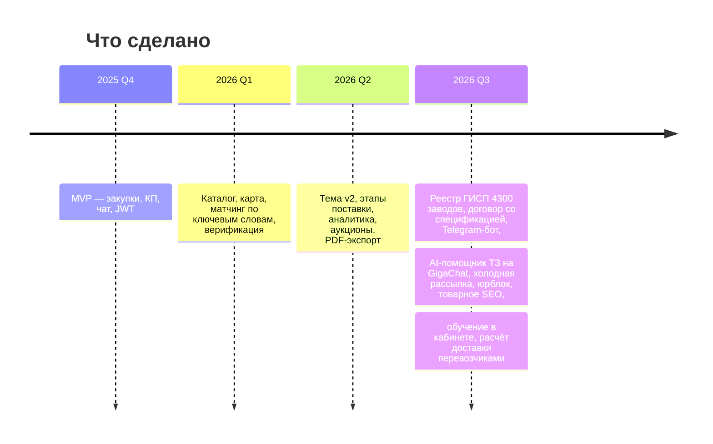

# Roadmap — ТехЗаказ

**Актуально на 08.08.2026.** Редакция от 30.07 переписала июньскую, которая вводила в заблуждение: в «критичном» числились задачи, давно закрытые (S3, email-верификация, httpOnly-куки), а инфраструктура описывалась по состоянию, которого уже нет. Один раз это стоило ошибки в опубликованном документе — в политику обработки данных попало утверждение о хранении базы за пределами РФ, взятое из устаревшего README.

Правило: если этот файл расходится с реальностью — чинить файл, а не подгонять реальность под него.

Правка 08.08: добавлен расчёт доставки, обновлено число тестов (в предыдущей редакции стояло 113 — устарело больше чем втрое).

## Где мы сейчас

| | |
|---|---|
| Прод | https://texzakaz.ru, VPS Selectel (Москва), PM2, автодеплой из `main` через GitHub Actions с CI-гейтом |
| Данные | PostgreSQL на самом VPS (`localhost`) — персданные в РФ, требование ст. 18 ч. 5 ФЗ-152 выполняется |
| Каталог | 4300 предприятий из реестра ГИСП ПП-719 и fabricators.ru, у 1900 есть email |
| Пользователи | 13 аккаунтов, из них 6 пришли из холодной рассылки |
| Закупки | 3 за всё время |
| Тесты | 432 юнита, `npm run check` + прогон тестов блокируют деплой. В сеть не ходят: интеграции проверяются по сохранённым ответам |

Последняя строка — главная. Продукт технически готов принимать поток, потока нет.

## Что уже работает

```mermaid
timeline
    title Что сделано
    2025 Q4 : MVP — закупки, КП, чат, JWT
    2026 Q1 : Каталог, карта, матчинг по ключевым словам, верификация
    2026 Q2 : Тема v2, этапы поставки, аналитика, аукционы, PDF-экспорт
    2026 Q3 : Реестр ГИСП 4300 заводов, договор со спецификацией, Telegram-бот,
            : AI-помощник ТЗ на GigaChat, холодная рассылка, юрблок, товарное SEO,
            : обучение в кабинете, расчёт доставки перевозчиками
```

Полный сквозной путь закрыт: заказчик размещает чертёж → матчинг уведомляет профильные заводы → приходят КП → сравнение с бенчмарком и выгрузкой в PDF → принятие → договор со спецификацией → этапы поставки → отзыв.

### Расчёт доставки (08.08.2026, третий перевозчик 13.08.2026)

В карточке КП заказчик видит не только цену изготовления, но и стоимость доставки от нескольких перевозчиков — ПЭК, Деловые Линии и Возовоз, наземная, экспресс и авиа. Маршрут берётся из сделки (город завода → город заказчика), габариты указывает завод при подаче КП.

Третьим планировался КИТ, ключ к их API получен. Не подключён по причине не на нашей стороне: `capi.gtdel.com` с 21.07.2026 отдаёт просроченный сертификат `*.gtdel.com`, и клиент, проверяющий TLS, туда не подключается вовсе. Обходить проверку сертификата ради расчёта нельзя, поэтому взят Возовоз — у него живой versioned API, документированные единицы измерения и осмысленные ошибки. КИТ вернём, если починят: модуль под него пишется по тому же контракту за вечер.

Что важно помнить при работе с этим кодом:

- **Цены публичные, а не договорные.** Мы не сторона сделки и цену от своего лица не обещаем — под расчётом стоит оговорка про публичный тариф. Убирать её нельзя: без неё первый же разошедшийся счёт станет претензией к платформе.
- **Проверка перевозчиков живёт вне деплойного гейта** (`npm run check:logistics`). Падение чужого сайта не должно останавливать нашу выкатку.
- **Оба капкана Деловых Линий были молчаливыми:** неверный формат кода города подставлял чужой город без ошибки, неверные единицы веса давали правдоподобную цену за несуществующий груз. Добавляя перевозчика, проверять надо не «отвечает ли», а «отвечает ли то же, что его собственный калькулятор». Подробности — в шапке `lib/logistics/dellin.js`.
- **У Возовоза капкан другой природы:** пункт задаётся названием, а «Москва» в их справочнике — семь разных мест, включая деревню в Кировской области. Расчёт при этом проходит, и о том, что выбор сделан за нас, говорит только `warnings` в ответе. Поэтому в запрос уходит только guid из их же поиска, а предупреждение про `location` считается отказом. Правило выбора города общее с нашим гео-слоем: разные терминалы у кандидатов — не считаем вовсе.

Оговорка по существу: эта работа спрос не приближает (см. следующий раздел). Она делает продукт лучше для тех, кто уже пришёл, и станет полезна ровно в той мере, в какой заводы начнут заполнять габариты.

### Чертёж до отклика (14.08.2026)

Первый живой завод прошёл путь подачи КП и уперся в то, чего мы не замечали: чертёж открывался только после подачи предложения, а предложение требует цену. Цену просили назвать вслепую.

Разомкнуто отдельным шагом «Посмотреть чертёж» — без цены и без обязательств. Защита не исчезла, но сменила природу: раньше чертёж почти никто не мог открыть, теперь его может открыть завод, который назвался. Запись именная (`order_drawing_requests`), заказчику приходит уведомление, кто именно открыл. Это осознанный размен: замок поменяли на журнал.

Там же вылез настоящий баг: кнопки «Просмотр» и «Скачать» рисовались всем подряд, сервер отвечал на них отказом, и завод получал на экран голый JSON «Нет доступа к чертежу этой закупки». Правило работало верно, а выглядело как поломка сайта. Кнопок, заведомо ведущих в ошибку, больше нет.

### Отказ по прямой ссылке (15.08.2026)

Продолжение того же разбора. Кнопки, ведущие в заведомый отказ, 14.08 убрали — но причина, по которой отказ выглядел поломкой сайта, осталась. Чертёж, файл КП, договор и все выгрузки открываются переходом браузера, а не через `apiFetch`, и ловить ответ там некому: любой отказ приезжал на экран голым JSON. Таких ссылок в интерфейсе около дюжины, и чинить их поштучно в разметке — значит забыть следующую.

Развилка теперь на сервере и по `Accept`, а не по маршруту: переход браузера получает страницу с причиной и кнопкой выхода, `fetch` — прежний JSON. Контракт API не тронут (`lib/http-errors.js`).

Отдельно — самая частая причина этих отказов, к правам отношения не имевшая. Access-кука живёт час и потом просто исчезает: `apiFetch` обновляет её сам, прямая ссылка — нет, поэтому человек, вошедший час назад и никуда не выходивший, получал «Требуется авторизация» при попытке скачать свой же файл. Сессия продлевается на сервере тем же обменом, что делает `POST /api/auth/refresh` (`lib/session-renew.js`), только на GET и HEAD: расширять cookie-авторизацию на запросы, которые что-то меняют, незачем. Ротации нет — соседние вкладки это не задевает.

425 юнитов, из них 10 новых: обе стороны развилки по `Accept` и продление сессии (чужой и протухший refresh, POST, удалённый пользователь).

### «Запомнить меня» (15.08.2026)

Обратная сторона предыдущего пункта. Раз сессия теперь продлевается сама, выбор «не запоминать» надо было наконец дать: до сих пор его не было вовсе — любой вход помнили тридцать суток, в том числе со стороннего компьютера в цеху или у снабженца на общей машине.

Галочка на входе стоит по умолчанию, поведение по умолчанию прежнее. Снятая означает буквально то, что написано: куки ставятся без срока и умирают вместе с браузером, а запись в `refresh_tokens` живёт 12 часов вместо месяца — иначе она осталась бы годным ключом к чужой машине, переживя закрытие браузера. Клиенты, которые про поле `remember` не знают (мобильное приложение, внешние интеграции), работают как раньше.

Тонкое место — продление: без флага в базе оно молча превращало бы разовый вход в постоянный. Поэтому `refresh_tokens.persistent` читают оба пути продления, и на это есть тесты. Второе такое же — метка о входе в `localStorage`: она переживает браузер, и кабинет успевал показаться вошедшим. Ловится по `sessionStorage`, который умирает ровно тогда же, когда куки.

В «Активных сессиях» разовый вход теперь так и назван: строка живёт до своих 12 часов и без подписи выглядела бы устройством, которое человек сам уже закрыл. Сессии, заведённые до этой правки, считаются постоянными — врать про них в интерфейсе нельзя.

432 юнита, из них 7 новых на галочку и список сессий.

## Главное ограничение

Не фичи. **Спрос.** 4300 поставщиков и три закупки — классическая ловушка маркетплейса: предложение набирается скрейпингом за недели, спрос набирается только руками.

Из этого следует приоритет: любая работа, которая не приближает первые двадцать регулярных заказчиков, — второстепенна, каким бы полезным ни казался код. Это касается и позиционных SEO-страниц, и мобильного приложения, и ML-матчинга.

## Ближайшее

| Задача | Состояние | От кого зависит |
|---|---|---|
| Почта на домене (Яндекс 360, MX/SPF/DKIM/DMARC) | план готов, `docs/ops-mail-domain.md` | доступ к DNS |
| Снятие лимита 20 писем в день у рассылки | после почты на домене, разгон по неделям | — |
| Позиционные страницы под ГОСТ-позиции | ждём частотность от маркетолога | парсинг семантики |
| Уведомление в Роскомнадзор об обработке ПДн | обязанность оператора по ст. 22 | владелец |
| Вычитка политики и условий юристом | тексты опубликованы, правки — отдельным коммитом | юрист |
| Настройка цели `register` в Метрике | код шлёт событие, цель не заведена | маркетолог |
| Заводы заполняют габариты в КП | 14.08 поля вынесены в отдельный шаг после отправки КП — форма подачи снова короткая | смотреть, вырастет ли доля заполнивших |
| Боевой ключ Возовоза в `VOZOVOZ_TOKEN` | код готов и проверен на их демо-сервере | регистрация в ЛК vozovoz.ru |

## Дальше, по мере появления спроса

- **Закрытые прямые закупки** — заказчик приглашает конкретные заводы, а не публикует всем.
- **Публичное API** для интеграции с ERP. Сейчас есть только выгрузка CommerceML для 1С; карточка в настройках честно говорит «в разработке».
- **ML-матчинг** вместо совпадения по ключевым словам — обучать имеет смысл на реальных принятых сделках, которых пока нет.
- **Мобильная версия и PWA** — снабженцы часто в цехах и в полях.
- **ЭДО и подписание** — только когда объём сделок это оправдает; сейчас договор скачивается и подписывается офлайн, и это осознанно.
- **Переход ИП → ООО** — крупный заказчик со службой безопасности и тендерным комитетом с ИП работать не станет. Делать под конкретную сделку, не заранее.

## Технический долг

| Долг | Риск | Что делать |
|---|---|---|
| Файлы (чертежи, КП, фото) в Cloudflare R2 — вне РФ | средний: раскрыто в политике, но для крупного заказчика может стать блокером | перевод на российское S3-совместимое хранилище |
| Нет бэкфилла `consent_at` у пользователей, зарегистрированных до 30.07.2026 | средний: колонка есть, но у старых аккаунтов пустая | спрашивать согласие при следующем входе |
| Два классификатора категорий: общий в `server.js` и витринный в `lib/producer-categories.js` | низкий, осознанный: общий тянут карта и биржа мощностей | свести, когда появится третий потребитель |
| Нет инструмента миграций БД, схема правится `ALTER TABLE ... IF NOT EXISTS` | низкий на текущем объёме | заводить, когда понадобится откат схемы |
| `/api/map` отдаёт 4300 записей одним куском | низкий: запрос кэшируется час, но ответ тяжёлый | урезать поля или отдавать по видимой области |
| Нет `.gitattributes`, `core.autocrlf` ломает сравнение сгенерированных страниц | низкий: гейты нормализуют переводы строк | добавить при удобном случае, это перезапишет весь репозиторий |
| Расчёт ПЭК висит на ajax-компоненте их Битрикса, а не на versioned API | средний: путь и формат могут поменяться при их редизайне без предупреждения | ловится `npm run check:logistics`, гонять по расписанию |
| Остатки в `server.js`: часть хелперов и inline-роутов | низкий | выносить по мере правок |

## Что решили не делать

- **SEO под тендеры 44-ФЗ и 223-ФЗ.** Другой рынок, другая аудитория, там ЭЦП и аккредитация. Наше предложение — закупки без тендерной бюрократии, и смешивать это вредно.
- **Гнаться за высокочастотными запросами вида «сварка», «лазерная резка».** Информационный интент, в выдаче справочники и обучение.
- **Обещать сроки и цены от лица площадки.** Мы не сторона сделки, и во всех текстах это выдержано.
- **Наращивать функциональность вместо поиска заказчиков.** См. раздел про главное ограничение.
