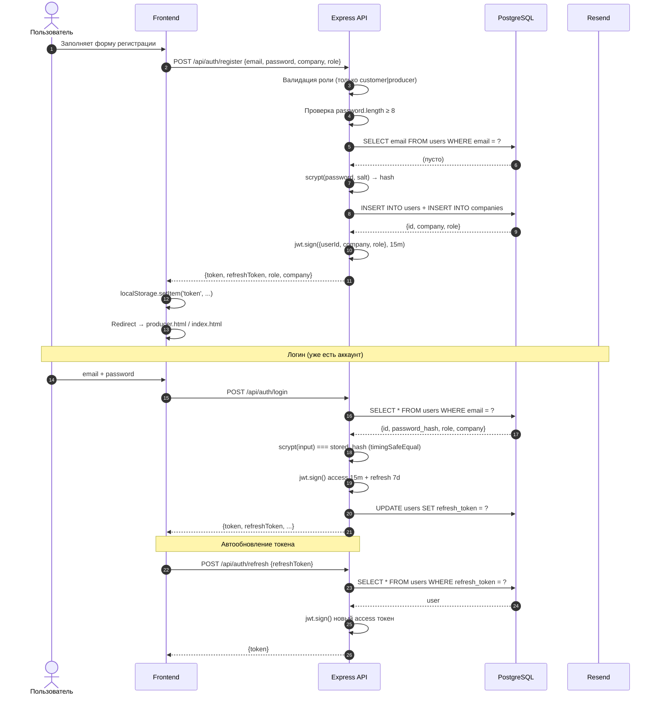
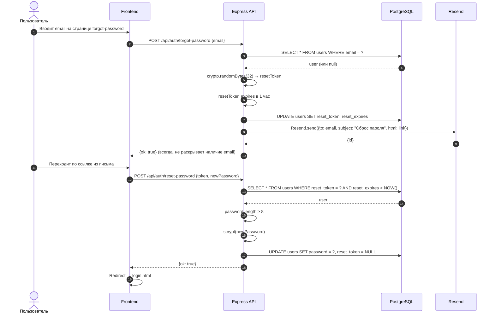
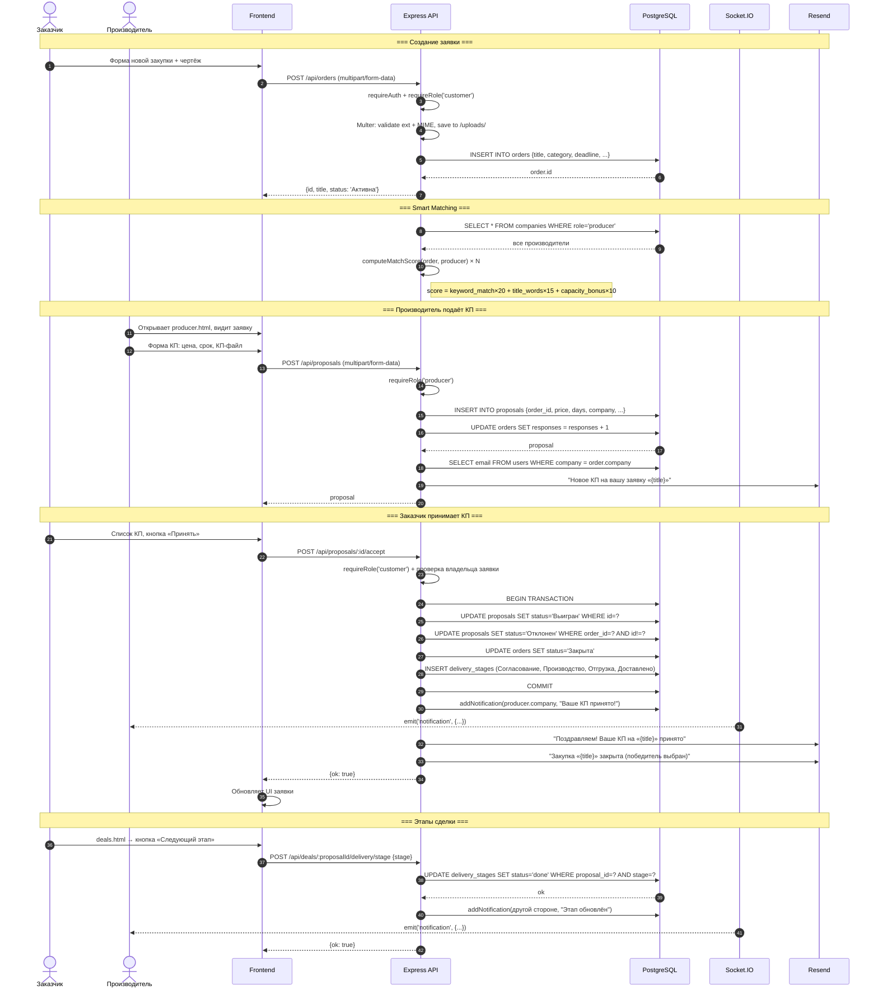
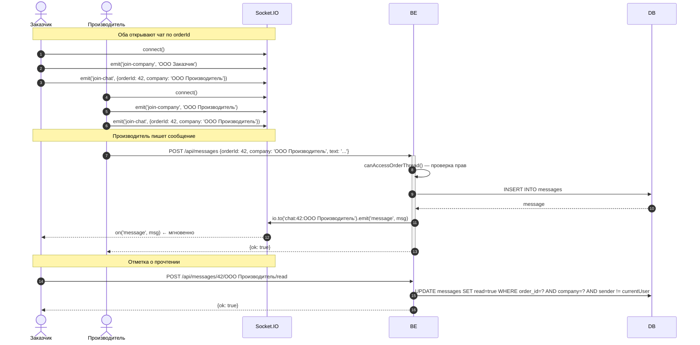
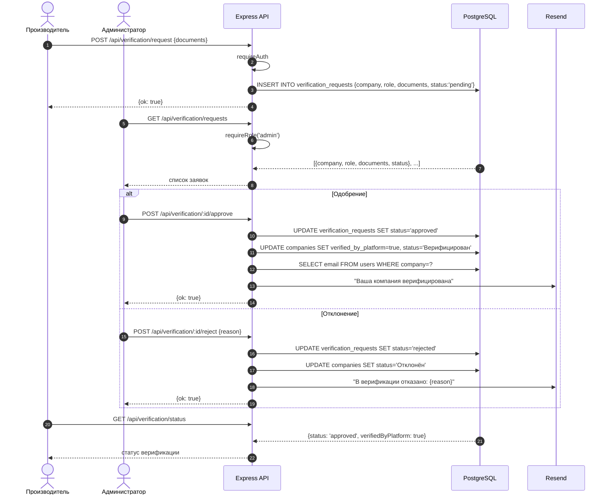
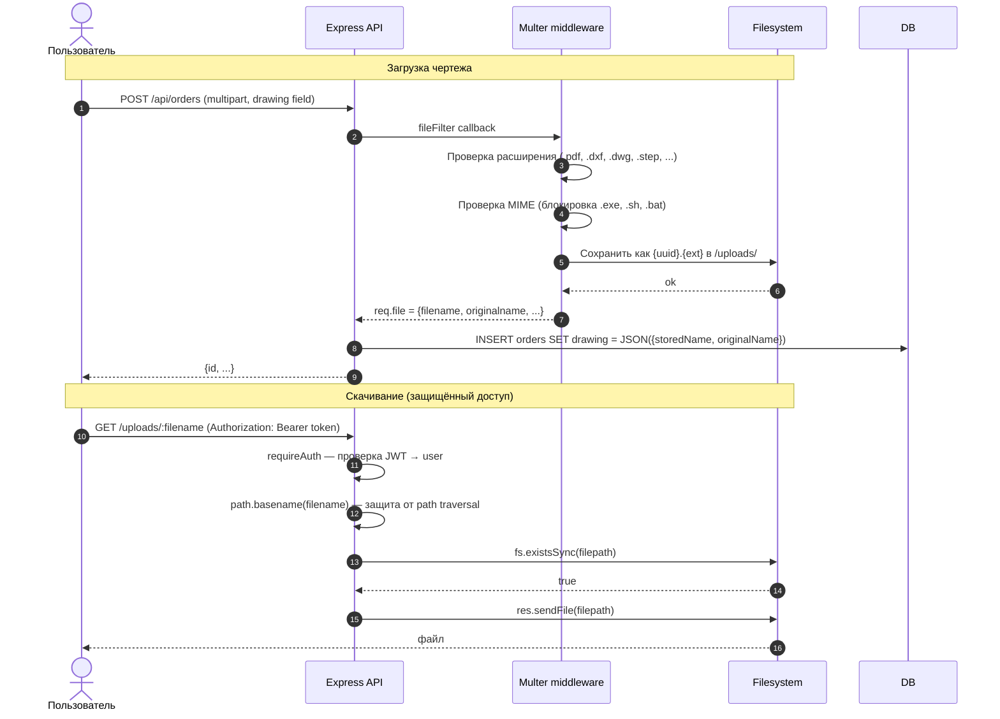

# Sequence Diagrams — B2B Нефтесервис

## 1. Регистрация и авторизация

---

## 2. Сброс пароля

---

## 3. Основной бизнес-флоу: Заявка → КП → Сделка

---

## 4. Реальное время: Чат между заказчиком и производителем

---

## 5. Верификация компании

---

## 6. Загрузка и доступ к файлам

